# Windows

### Table of Contents

1. [Git + GitHub](#git+github)
2. [Visual Studio Code](#vscode)
3. [Node.js + npm](#nodejs+npm)
4. [Docker](#docker)

### [Git + GitHub](#git+github)

Our team is using GitHub to host our remote repository for the Git VCS. This includes conveniences such as branching, pull requests, issue tracking, releases, and more. The first step to getting started on the GitHub platform is to make an account and get access from the team. 

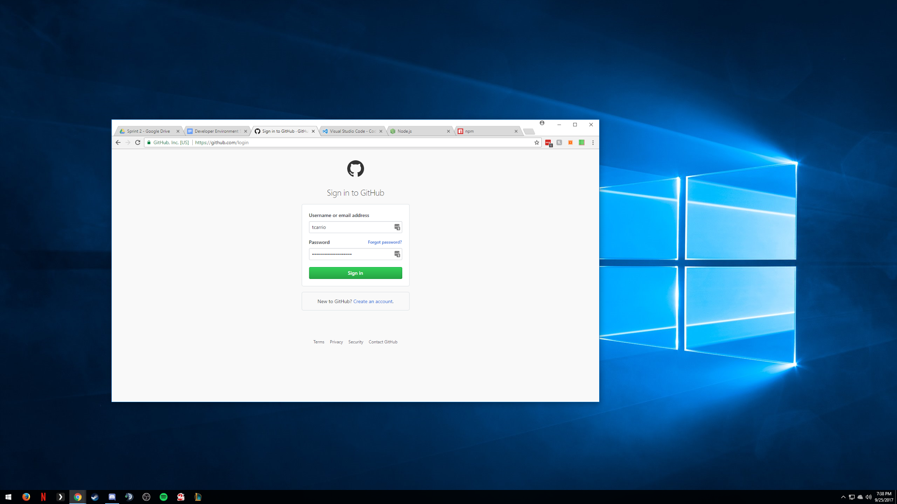

Once the team leader has provisioned you access by your username, you can now begin working with any repositories under our organization. When you get to the main project you’ll have a few methods of syncing the repository to your computer. Both of them are packaged in the GitHub software download, and includes the GitHub client as well as the Git command line client. You can download the software at [https://desktop.github.com/]. 

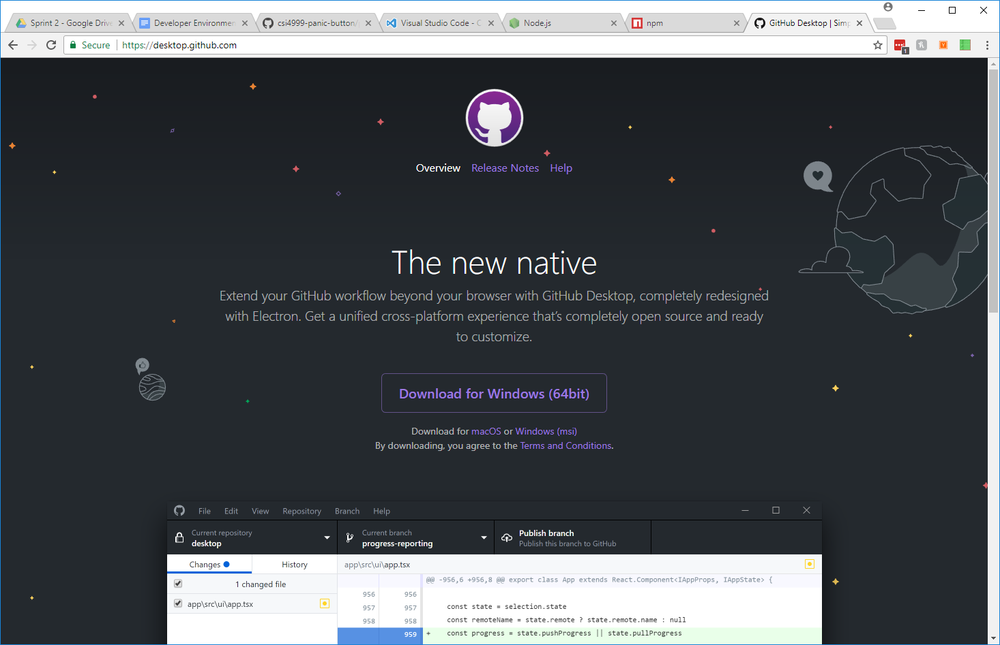

After you’ve downloaded it, you can login to your account to link your GitHub.com account. 

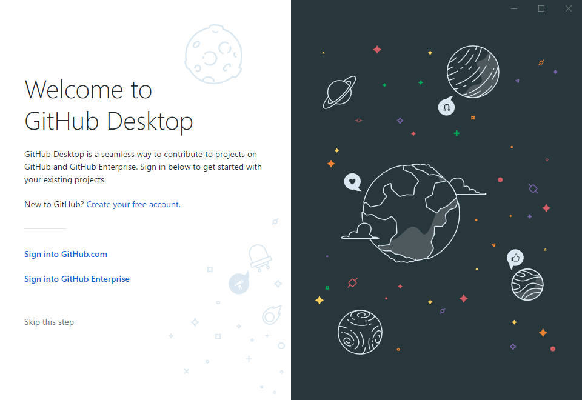

Once you’ve linked your account, you can click the Clone a repository and get the project from underneath the project section.

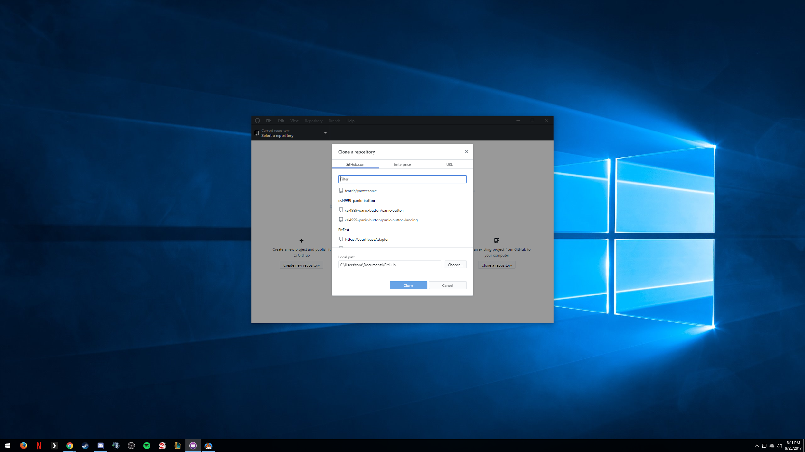

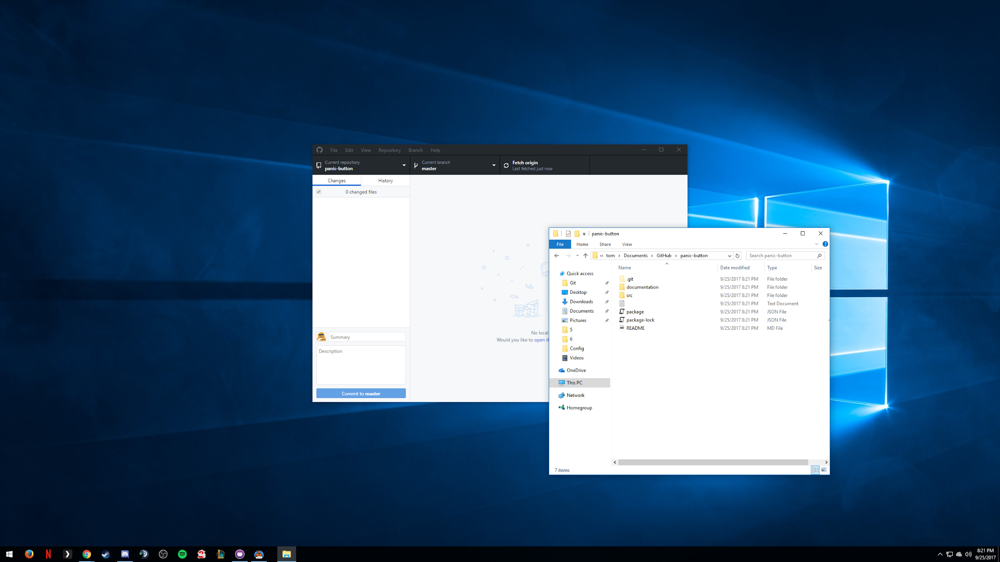

If you are setting up the Git command line client, you’ll need to launch the Git Shell from All Programs. It will run an installer for the first time.

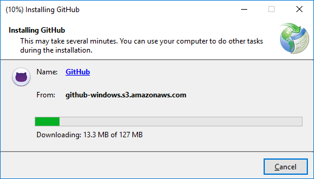

After this is finished you will have the Git Shell running and available any time. You can now use the git command and clone repositories such as the team project and your personal repositories. 

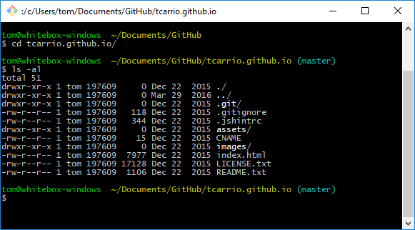

You can get information on using the Git Shell from https://git-scm.com/docs/gittutorial, and information on using the GitHub Desktop client from https://guides.github.com/activities/hello-world/. 

### [Visual Studio Code](#vscode)

This is an Electron application made by Microsoft which is highly useful for web-based development but is also highly extendable into many development platforms. It can be downloaded from https://code.visualstudio.com/. Once you have installed it you will be able to open the project you have cloned to your system. Use the same path you cloned the repository to initially and you can begin working with the code. 

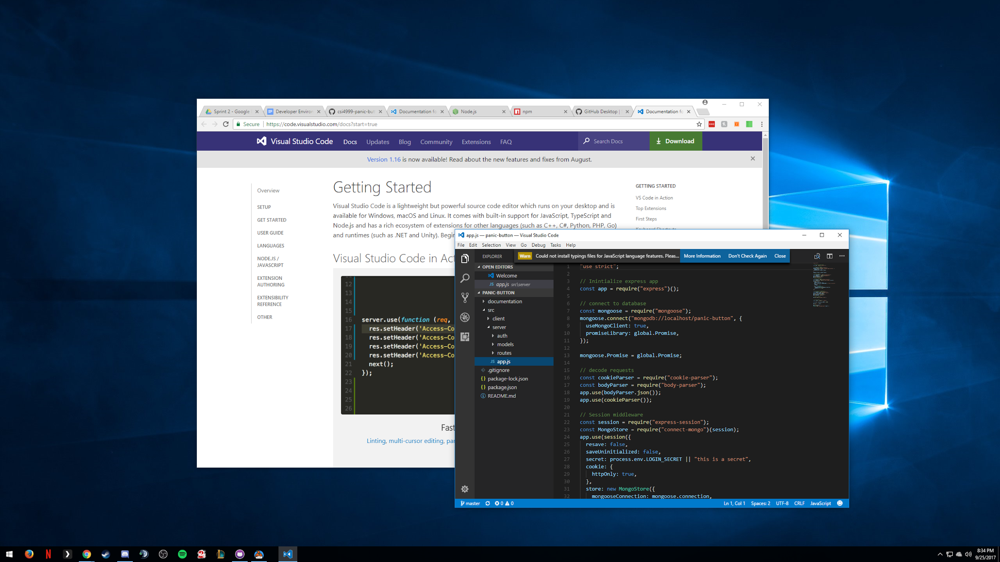

Visual Studio Code also offers Git integration, so you will be able to track changes to files since your last commit as well. It is also possible to set up a file for running your codebase by pressing Ctrl+Shift+P and typing “launch.json”. Choose the “Debug: Open launch.json” option. In here you can set up your launch configuration for running your project. But first, you will need Node.js to actually run the configuration. Move on to the next step.

### [Node.js + npm](#nodejs+npm)

Node.js is a JavaScript runtime built on Chrome's V8 JavaScript engine. Download it from https://nodejs.org/en/, and make sure to download version 8.x (at the time of writing, 8.5.0 was the current version). When you install it, all options should be available. When it is done, the node and npm commands should be available. As a test, you can open up a terminal with either cmd.exe or the built-in terminal on Visual Studio Code to test. At this point you will likely need to restart, as the PATH is not updated by this installer nor the Visual Studio Code installer. 

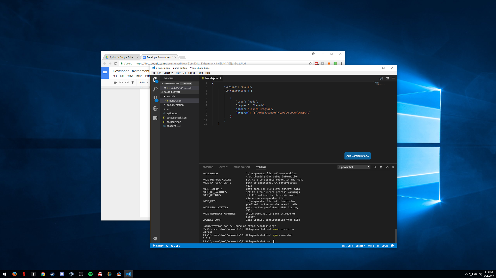

You can test whether both node and npm have been installed now with the terminal in Code using Ctrl+` and running node --version and npm --version. With the launch.json file up, you should have something similar to:

```json
{
       "version": "0.2.0",
       "configurations": [
          
           {
               "type": "node",
               "request": "launch",
               "name": "Launch Program",
               "program": "${workspaceRoot}\\src\\server\\app.js"
           }
       ]
   }
```

Now you can run the configuration using F5. But first, you’re going to need to install everything for the client and server side. Under the client and server folders, we have a package.json file. This contains all the libraries that need to be installed for Node to run the application. Npm is included with Node to let you easily install everything listed in there and all their dependencies. You can install these packages by running npm install from the directory you are working in, either $projectdir/ or $projectdir/src/client. 

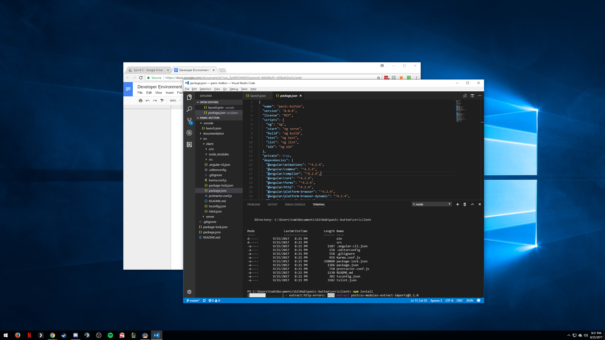

With all the packages installed for the server side, you can launch your run configuration now. Hit F5, and navigate to [http://localhost:3000](http://localhost:3000) to test the server end. 

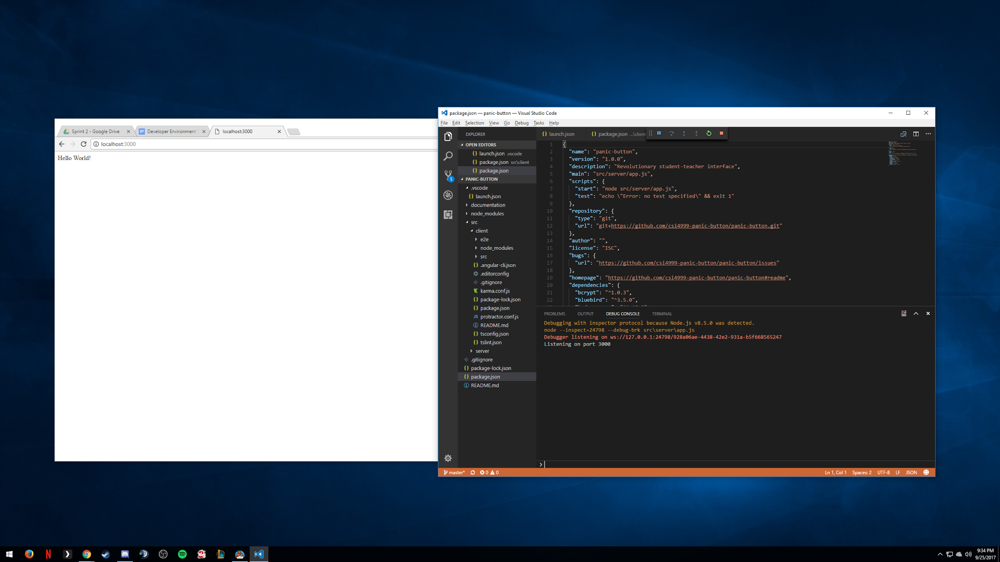

### [Docker](#docker)

Docker is the world’s leading software container platform. Containers are a way to package software in a format that can run isolated and do not bundle a full operating system, unlike virtual machines. They make for efficient, lightweight, self-contained systems that guarantee software will always run the same, regardless of where it is deployed. By utilizing Docker in our testing and deployment phases, we can ensure that no development environment causes issues in our bug tracker, and that all developers are working with a standardized platform for development. Docker can be downloaded from their website at [https://store.docker.com/editions/community/docker-ce-desktop-windows](https://store.docker.com/editions/community/docker-ce-desktop-windows).


When the installer completes, it will ask you to log out of Windows to complete the installation. 


At this point your computer may need to reboot to enable virtualization hardware on your computer. Once you have Docker started, you should be able to test it with your terminal. A `docker --version` will do:


The Dockerfile included makes deploying and testing the server-side standard on all platforms. This builds from the official Node Docker image, so all developers can deploy on a standardized version while also making cloud deployment much easier. You can continuously build new Docker images by running the following command:

```bash
docker build -t csi4999/panic-button .
```

After you have built the image you can start the application by running:

```bash
docker run -p 3000:3000 -d --name pb csi4999/panic-button
```

If you're clearing this image to make a new one, you can chain the following commands together to stop and remove the container, and remove the image:

```bash
docker stop pb; docker rm pb; docker rmi tcarrio/panic-button
```